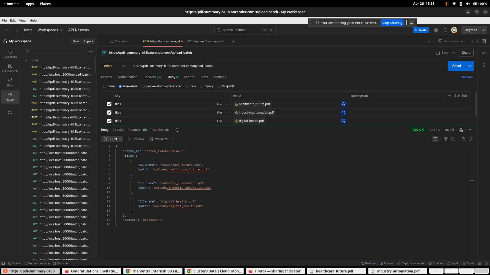
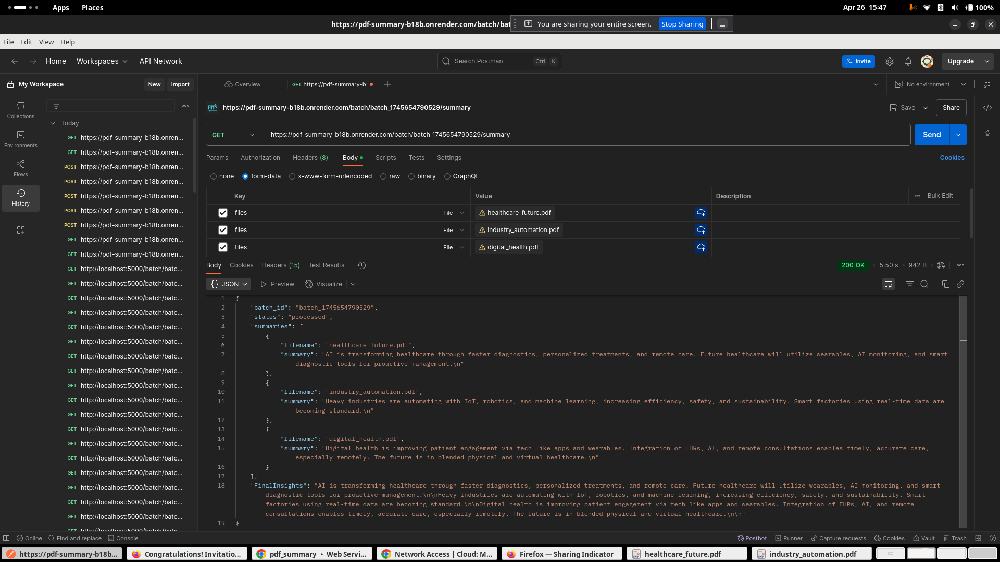
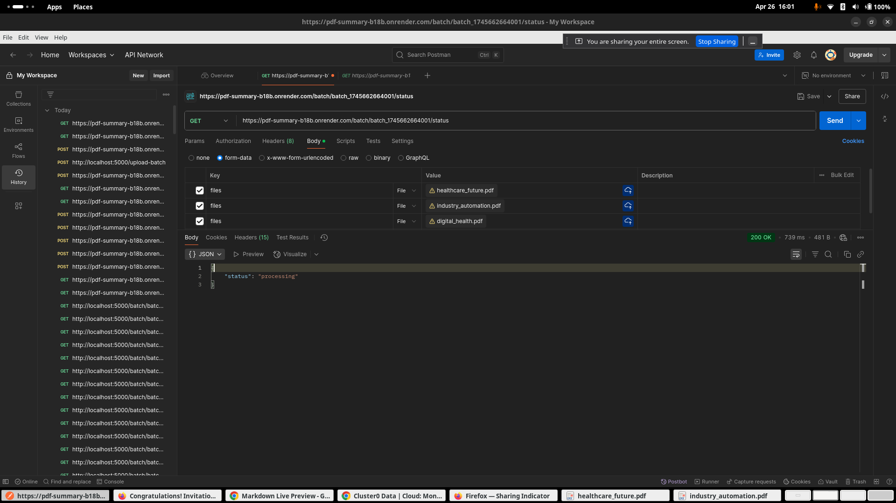
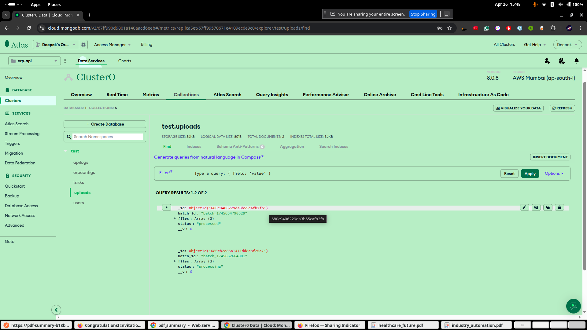

# PDF Summary Bot

<!-- ## Headers

# This is a Heading h1
## This is a Heading h2
###### This is a Heading h6 -->

## Local Setup

```bash
git clone https://github.com/deepakbhagatiitr/pdf_summary.git

```
##### make a .env file and add three variable in it 

##### GEMINI_API_KEY= get it

##### MONGO_URI= mongourl either localhost or atlas

##### PORT=5000

Install Dependency
```bash
npm install

```

Run command
```bash
nodemon

```

## API Examples(Postman)


Paste the below api route and go to the body form-data

in key type files choose the file option and in value choose the file from the your PC
then press send
```
(post)https://pdf-summary-b18b.onrender.com/upload-batch
``` 

paste the below api route hit the get request
```
(get)https://pdf-summary-b18b.onrender.com//batch/:batch_id/status
```

paste the below api route hit the get request
```
(get)https://pdf-summary-b18b.onrender.com//batch/:batch_id/summary
```

## Response Images





## Response Images

for post request on https://pdf-summary-b18b.onrender.com/upload-batch

```
{
    "batch_id": "batch_1745664537209",
    "files": [
        {
            "filename": "healthcare_future.pdf",
            "path": "uploads/healthcare_future.pdf"
        },
        {
            "filename": "industry_automation.pdf",
            "path": "uploads/industry_automation.pdf"
        },
        {
            "filename": "digital_health.pdf",
            "path": "uploads/digital_health.pdf"
        }
    ],
    "status": "processing"
}
```


for get request on https://pdf-summary-b18b.onrender.com/batch/batch_1745654790529/summary
```
{
    "batch_id": "batch_1745654790529",
    "status": "processed",
    "summaries": [
        {
            "filename": "healthcare_future.pdf",
            "summary": "AI is transforming healthcare through faster diagnoses, personalized treatments, remote care, and smart monitoring. Wearable devices and AI-powered systems will become increasingly crucial for proactive health management.\n"
        },
        {
            "filename": "industry_automation.pdf",
            "summary": "Heavy industries are increasingly using automation (IoT, robotics, machine learning) to boost efficiency, safety, maintenance, and sustainability, leading to smart factories.\n"
        },
        {
            "filename": "digital_health.pdf",
            "summary": "Digital health is improving patient engagement and care through technology like apps, wearables, and virtual platforms. Integration with EHRs, AI, and remote consultations enables timely and accurate care, especially in remote areas. The future is hybrid care combining physical and virtual experiences.\n"
        }
    ],
    "FinalInsights": "AI is transforming healthcare through faster diagnoses, personalized treatments, remote care, and smart monitoring. Wearable devices and AI-powered systems will become increasingly crucial for proactive health management.\n\nHeavy industries are increasingly using automation (IoT, robotics, machine learning) to boost efficiency, safety, maintenance, and sustainability, leading to smart factories.\n\nDigital health is improving patient engagement and care through technology like apps, wearables, and virtual platforms. Integration with EHRs, AI, and remote consultations enables timely and accurate care, especially in remote areas. The future is hybrid care combining physical and virtual experiences.\n\n"
}

```

for get request on https://pdf-summary-b18b.onrender.com/batch/batch_1745654790529/status
```
{
    "status": "processed"
}
```


## Deployed API
https://pdf-summary-b18b.onrender.com


